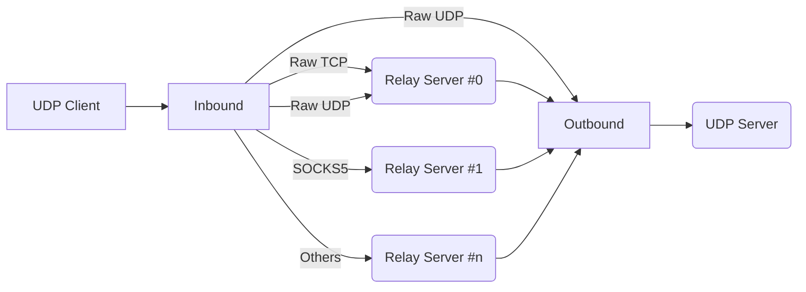

# ParaCat: A SIMO/MISO forwarder for high reliability/throughput

In crowded Internet, all connections are not reliable. To minimize jitter and packet loss, we can send it through different routes simultaneously then get redundancy.

## Structure

## TODO

- [ ] Remove unused UDP connections
- [ ] Optimize delay
- [ ] Re-connect after EOF
- [ ] Round-robin mode
